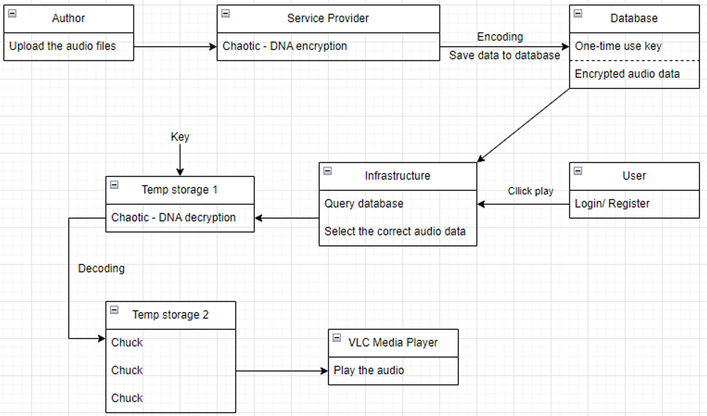

# ENCRYPTION OF AUDIO DATA ON A MULTIMEDIA PRODUCT SERVICE PLATFORM

**Students:**

- Duong Pham Huy Thong (2252121431)  
- Cao Qui (22521208)

**Class:** NT219.O11.ANTN  
**Lecturer:** PhD. Nguyen Ngoc Tu

---

## Table of Contents

- [Introduction](#1-introduction)
- [Background](#2-background)
- [Proposed Solution and Implementation](#3-proposed-solution-and-implementation)
- [Experiments and Results](#4-experiments-and-results)
- [Conclusion and Future Work](#5-conclusion-and-future-work)

---

## 1. Introduction

### 1.1. Project Topic

**Title:** Audio Data Encryption on a Multimedia Product Service Platform

### 1.2. Problem Context

The rapid growth of audio data, including films, videos, podcasts, and online music, necessitates robust encryption solutions for secure storage, transmission, and access control on multimedia service platforms. Enhancing audio encryption is crucial for improving user experience on mobile and internet-connected devices.

### 1.3. Motivation

Audio is a vital component of multimedia services. Encrypting audio data ensures:

- High-quality and seamless user access.
- Protection against unauthorized access and tampering during transmission.

### 1.4. Objectives

Develop an encryption and decryption system to ensure:

- Confidentiality
- Integrity
- Availability of audio data during streaming.

### 1.5. Stakeholders

- **Service Provider:** Implements security measures and ensures quality of service.
- **Author:** Uploads audio files.
- **User:** Registers, logs in, purchases content, and streams audio.
- **Infrastructure:** Provides secure storage and transmission.
- **Attacker:** Attempts unauthorized access to copyrighted content.

### 1.6. Proposed Solution

- Build an online music streaming platform.
- Encrypt and securely store audio data.
- Decrypt and serve audio to authorized users.

---

## 2. Background

### 2.1. Double DNA Encoding

Double DNA encoding is a dual-stage process:

- **Binary to DNA Mapping:** Binary data is converted to DNA sequences (A, C, G, T).
- **DNA Addition:** The DNA sequence is combined with two other DNA sequences using DNA addition rules.
- **Result Conversion:** The resulting DNA sequence is converted back to binary for further encryption steps.

### 2.2. Chaotic Maps

Chaotic maps generate high-entropy pseudo-random sequences essential for robust encryption:

- **Properties:** Non-linearity and sensitivity to initial conditions.
- **Types Used:** Sine-Cosine Map (SC map) and Logistic Sine-Cosine Map (LSC map) for improved randomness.

---

## 3. Proposed Solution and Implementation

### 3.1. System Architecture

The system is designed to ensure secure and efficient uploading, encryption, storage, and playback of audio. Key components include:

- **Author Upload:**
  - The author uses a user interface to upload audio files.
  - The system receives the file, checks the format, and prepares it for encryption.

- **Encryption:**
  - The audio file is encrypted using a proposed algorithm (e.g., AES combined with chaotic maps).
  - A one-time use key is generated during encryption.
  - The encrypted file and key are securely stored in the database.

- **Storage:**
  - The database uses a secure storage system to ensure integrity and prevent unauthorized access.
  - Encrypted audio files and keys are linked via a unique identifier.

- **User Interaction:**
  - Users log in with registered credentials.
  - The interface displays available songs for selection.

- **Decryption:**
  - The system retrieves the encrypted audio file and corresponding key from the database.
  - The file is decrypted using the stored key.
  - Decrypted audio data is temporarily stored for playback.

- **Streaming:**
  - The decrypted audio is streamed via an integrated VLC media player.
  - After playback, the temporary file is deleted to prevent unauthorized access.

### 3.2. Encryption Process

The encryption process protects audio data by combining modern encryption techniques with chaotic maps. Specific steps include:

- **Import and Store Audio Data:**
  - Read the audio file from the input source.
  - Convert audio data into byte format for easy processing.

- **Initialize Encryption Key and Vector:**
  - Generate a secret key (`SecretKey`) and initialization vector (`InitialVector - IV`) for encryption.
  - These parameters can be randomly generated or based on user information.

- **Generate Pseudo-Random Sequence Using Chaotic Maps:**
  - Use chaotic maps like Sine-Cosine Map or Logistic Sine-Cosine Map to create a random sequence.
  - This sequence is crucial for permutation and diffusion steps.

- **Perform Permutation and Diffusion:**
  - **Permutation:** Rearrange the byte order of audio data based on the random sequence to create confusion.
  - **Diffusion:** Alter byte values based on the random sequence to ensure changes propagate throughout the data.

- **Generate SecretKey and InitialVector:**
  - `SecretKey` and `InitialVector` are derived from initialization parameters, ensuring uniqueness for each file.
  - These values are stored for use in decryption.

- **Encrypt Audio Data:**
  - Apply an encryption algorithm (e.g., AES) with `SecretKey` and `InitialVector` to encrypt the permuted and diffused data.
  - Store the encrypted data along with key information securely.

### 3.3. Decryption Process

The decryption process restores the original audio data for user playback. Steps include:

- **Import Encrypted Audio File:**
  - Retrieve the encrypted audio file from the database.

- **Initialize Decryption Parameters:**
  - Retrieve the corresponding `SecretKey` and `InitialVector` from the database.
  - Initialize necessary parameters for decryption.

- **Reproduce Pseudo-Random Sequence Using Chaotic Maps:**
  - Recreate the random sequence using the same chaotic map and parameters as in encryption.

- **Reverse Permutation and Diffusion:**
  - **Reverse Diffusion:** Undo the diffusion process to restore original byte values.
  - **Reverse Permutation:** Rearrange bytes back to their original positions based on the random sequence.

- **Decrypt Audio Data:**
  - Use the decryption algorithm (e.g., AES) with `SecretKey` and `InitialVector` to decrypt the data.
  - Store the decrypted data temporarily.

- **Streaming:**
  - Play the decrypted audio through the VLC media player.
  - Delete the temporary file immediately after playback to ensure security.

---

**Additional Notes:**

- **Double DNA Encoding:** Integrated into permutation and diffusion to enhance security. Binary data is encoded into DNA sequences, DNA addition is performed, and then converted back to binary.
- **Chaotic Maps:** Generate highly chaotic random sequences, making permutation and diffusion resistant to brute-force attacks.
- **One-time Use Key:** Each playback session uses a unique key, reducing the risk of key reuse and enhancing security.

---

## 4. Experiments and Results

- **User Authentication:** Secure registration and login with hashed passwords.
- **Audio Selection:** Users select audio; encryption and decryption processes are triggered.
- **Key Management:** One-time use key generated and tracked in the database.
- **Streaming:** Decrypted audio streamed via VLC; temporary files deleted post-playback.

---

## 5. Conclusion and Future Work

### 5.1. Conclusion

- Developed a basic platform for secure online audio streaming.
- Achieved successful encryption and decryption with expected performance.
- Ensured data confidentiality and prevented unauthorized access.

### 5.2. Future Work

- Explore advanced encryption algorithms (e.g., lossless encryption, feature-based encryption).
- Support multiple audio formats (mp3, wav, m4a).
- Integrate with popular platforms (YouTube, Spotify, SoundCloud).
- Develop mobile-based audio encryption solutions.
- Expand to a full online system with additional services.
- Optimize algorithms for real-time performance.
